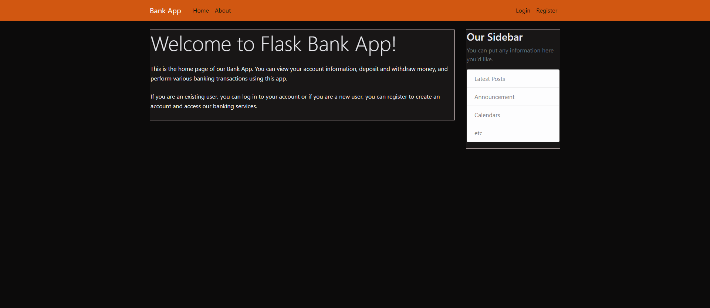
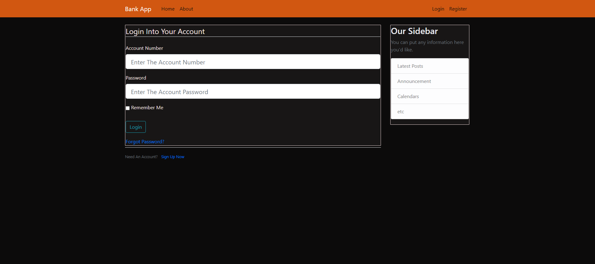

# Bank Api

Bank App is a simple web application built with Flask, a lightweight web framework in Python. It allows users to manage their bank accounts online, perform transactions, and check their account balance and transaction history.

## Features

- **Account Management**: Users can create accounts, view account details, and update account information.

- **Transactions**: Perform transactions such as deposits, withdrawals, and fund transfers.

- **Balance Inquiry**: Check account balance in real-time.

- **Transaction History**: View a list of transactions with details.

## Getting Started

### Prerequisites

- Python 3.x installed on your machine.
- [Virtualenv](https://pypi.org/project/virtualenv/) for creating a virtual environment.

### Installation

1. Clone the repository:

    ```bash
    git clone https://github.com/suryanattzz/flask-bank-app.git
    cd flask-bank-app
    ```

2. Create and activate a virtual environment:

    ```bash
    virtualenv venv
    source venv/bin/activate  # For Windows, use `venv\Scripts\activate`
    ```

3. Install dependencies:

    ```bash
    pip install -r requirements.txt
    ```

### Usage

1. Run the Flask app:

    ```bash
    python app.py
    ```

2. Open your browser and go to [http://localhost:5000/](http://localhost:5000/).

## Screenshots

Include screenshots or gifs showcasing different functionalities of your Flask Bank App.


*Home Page Of the App*


*Login page of the App


